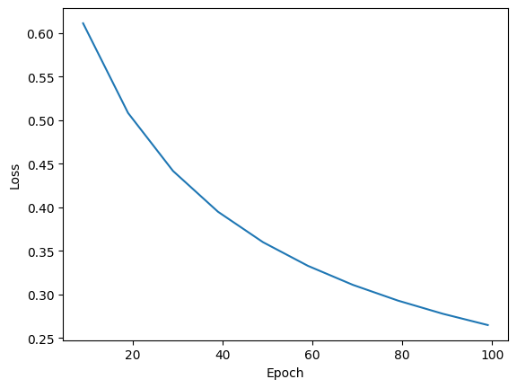
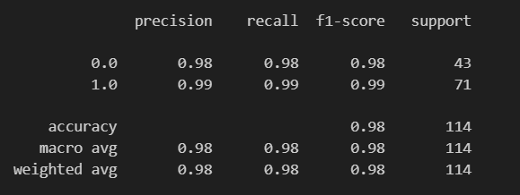

# Logistic Regression for Breast Cancer Classification Using PyTorch

This project demonstrates how to implement logistic regression using PyTorch to classify whether tumors are malignant or benign based on features from the Breast Cancer Wisconsin dataset.

## Project Overview

The goal of this project is to:
- Apply logistic regression to a binary classification problem.
- Use PyTorch to build, train, and evaluate the model.
- Understand the application of logistic regression in medical diagnosis.

## Features

- Load and preprocess the Breast Cancer Wisconsin dataset.
- Normalize features for efficient training.
- Define a simple logistic regression model using PyTorch.
- Train the model using binary cross-entropy loss and stochastic gradient descent (SGD).
- Evaluate model accuracy and performance.
- Classification report for more detailed evaluation.

## Dataset

This project uses the **Breast Cancer Wisconsin (Diagnostic) Dataset** from the UCI Machine Learning Repository, available via `sklearn.datasets`.

- Features are computed from a digitized image of a fine needle aspirate (FNA) of a breast mass.
- The dataset contains 569 instances and 30 features.
- Target variable: 0 (malignant) or 1 (benign)

## Technologies Used

- Python 3
- PyTorch
- Scikit-learn
- Matplotlib
- NumPy
- Pandas

## Model
- Linear Transformation of input features via `nn.Linear(#input_features, 1)`.
- Appplication of Sigmoid function via `torch.sigmoid()`.

## 📊 Results

- The model demonstrates high accuracy (98.25%) in distinguishing between malignant and benign tumors.
- Losses are plotted to show training progress.

  

- Classification Report

  

